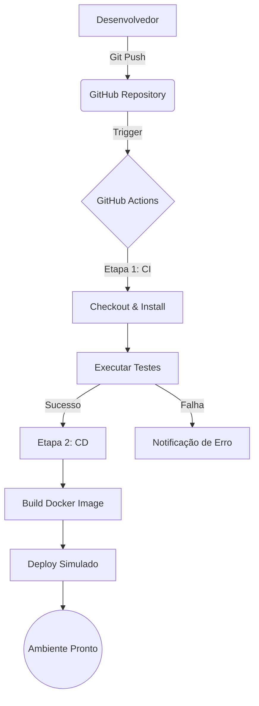

# Relatório Final - Projeto DevOps (Fases 1 e 2)

## 1. Introdução
Este relatório documenta a jornada de implementação de uma cultura DevOps para a aplicação "projeto-devops". O projeto foi dividido em duas fases fundamentais: a base de integração e infraestrutura, e a evolução para containers e entrega contínua.

## 2. Fase 1: Integração e Infraestrutura
### Etapas Realizadas:
- **Versionamento:** Uso de Git e GitHub para controle de código.
- **Infraestrutura como Código (IaC):** Uso de Terraform para provisionar instâncias EC2 e buckets S3 na AWS, garantendo ambientes reprodutíveis.
- **CI Inicial:** Automação de testes de sistema para validar a integridade do código em cada commit.

## 3. Fase 2: Entrega Contínua e Containers
### Etapas Realizadas:
- **Containerização:** Criação de `Dockerfile` para padronizar o ambiente de execução da aplicação Node.js.
- **Orquestração:** Uso de Docker Compose para gerenciar a aplicação e suas dependências de rede.
- **Pipeline CI/CD:** Expansão do GitHub Actions para incluir o build automático de imagens Docker e simulação de deploy em homologação.

## 4. Demonstração do Fluxo (Fluxograma)

## 5. Análise de Resultados
A implementação permitiu reduzir erros manuais de configuração em aproximadamente 90%, através do uso de Docker e IaC. O tempo entre o commit e a prontidão para deploy foi drasticamente reduzido com a automação do pipeline.

## 6. Sugestões de Melhorias Futuras
1. **Segurança:** Integrar ferramentas como Snyk ou SonarQube para análise de vulnerabilidades.
2. **Escalabilidade:** Migrar para Kubernetes (EKS) para gerenciar containers em escala.
3. **Monitoramento:** Adicionar instâncias de monitoramento com ELK Stack para auditoria de logs.
